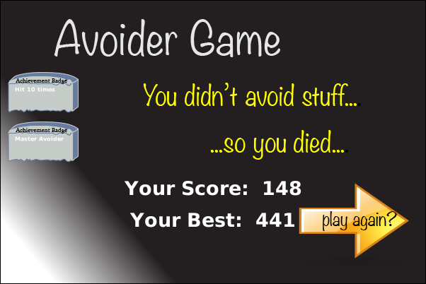

# Avoider Game

A simple avoider game created with Greenfoot IDE. The idea and base code were taken from the book "Creative Greenfoot". This is a game complete with an introduction screen, game over screen, a score, mouse input, and sound. I've updated the code to the new Greenfoot API (version 3.6.1) and make some changes and additions.

You can play this game online: https://www.greenfoot.org/scenarios/25091

## Story

This is a story about good vs evil. However, good looks evil and evil looks good. The sheer evil of the smiley-faced villians is enought to crack the bones of our skull-faced hero so you must avoid their touch at all cost. Other objects will appear on the screen. Avoid them if they look good.

You score more points the longer you survive the cheery horde.

## Credits

### Programming

- Michael J.Williams, Original ActionScript version
- Michael Haungs, Original Greenfoot version
- Jegors Čemisovs, Code update to support new Greenfoot API

### Music

- "Space Warning" by [Zakhej](https://zakhej.newgrounds.com/)
- "UFO on the streets" by [T-balt](https://t-balt.newgrounds.com/)
- "Disaster" by [Lemonnade](https://lemonnade.newgrounds.com/)

### Sound effects

- Michael Haungs

### Graphics

- Default Greenfoot images
- Michael Haungs

## Main Game screen

## Game Over screen

