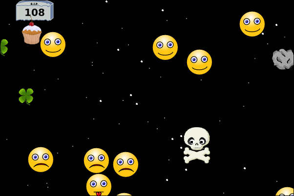

# Avoider Game
A simple avoider game created with Greenfoot IDE. The idea and base code was taken from the book "Creative Greenfoot".
This is a game complete with an introduction screen, game over screen, a score, mouse input, and sound.

I've updated the code to new Greenfoot API (version 3.6.1). 

## Main Game screen

## Game Over screen

